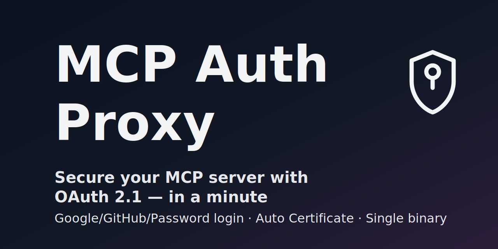

# MCP Auth Proxy



> If you found value here, please consider starring.

## Overview

- **Drop-in OAuth 2.1/OIDC gateway for MCP servers — put it in front, no code changes.**
- **Your IdP, your choice**: Google, GitHub, or any OIDC provider — e.g. Okta, Auth0, Azure AD, Keycloak — plus optional password.
- **Publish local MCP servers safely**: Supports all stdio, SSE, and HTTP transports. For stdio, traffic is converted to `/mcp`. For SSE/HTTP, it’s proxied as-is. Of course, with authentication.
- **Verified across major MCP clients**: Claude, Claude Code, ChatGPT, GitHub Copilot, Cursor, etc. — the proxy smooths client-specific quirks for consistent auth.

---

📖 **For detailed usage, configuration, and examples, see the [Documentation](https://sigbit.github.io/mcp-auth-proxy/)**

## Quickstart

> Domain binding & 80/443 must be accessible from outside.

Download binary from [release](https://github.com/sigbit/mcp-auth-proxy/releases) page.

If you use stdio transport

```sh
./mcp-auth-proxy \
  --external-url https://{your-domain} \
  --tls-accept-tos \
  --password changeme \
  -- npx -y @modelcontextprotocol/server-filesystem ./
```

That's it! Your HTTP endpoint is now available at `https://{your-domain}/mcp`.

- stdio (when a command is specified): MCP endpoint is https://{your-domain}/mcp.
- SSE/HTTP (when a URL is specified): MCP endpoint uses the backend’s original path (no conversion).

## Why not MCP Gateway?

MCP Gateway: **A hub for operating multiple MCP servers together** (container isolation, catalog integration)  
mcp-auth-proxy: **A lightweight proxy that adds authentication in front of any MCP server** (+ stdio→HTTP(S) conversion, optional)

### When to choose `mcp-auth-proxy`

- **You just want to add auth to one or a few MCPs** (enforce OAuth/OIDC/password with zero changes to the server)
- **Container operations and catalog integration aren’t needed** (ideal for small setups, testing/PoC, or one-off exposure)

### When to choose MCP Gateway

- **Operating many MCPs at organizational scale** (provisioning, policy/permissions, audit, centralized logs)
- **You want operations features** like container isolation and catalog integration

_Note_: They are not mutually exclusive. You can **put `mcp-auth-proxy` in front of a Gateway's public endpoint to enforce authentication** if the Gateway itself doesn't handle it.

**TL;DR:** Orchestrate many → Gateway / Expose safely & quickly → mcp-auth-proxy

## Verified MCP Client

| MCP Client        | Status | Notes                                            |
| ----------------- | ------ | ------------------------------------------------ |
| Claude - Web      | ✅     |                                                  |
| Claude - Desktop  | ✅     |                                                  |
| Claude Code       | ✅     |                                                  |
| ChatGPT - Web     | ✅     | Need to implement `search` and `fetch` tools.(1) |
| ChatGPT - Desktop | ✅     | Need to implement `search` and `fetch` tools.(1) |
| GitHub Copilot    | ✅     |                                                  |
| Cursor            | ✅     |                                                  |

- \*1: https://platform.openai.com/docs/mcp
