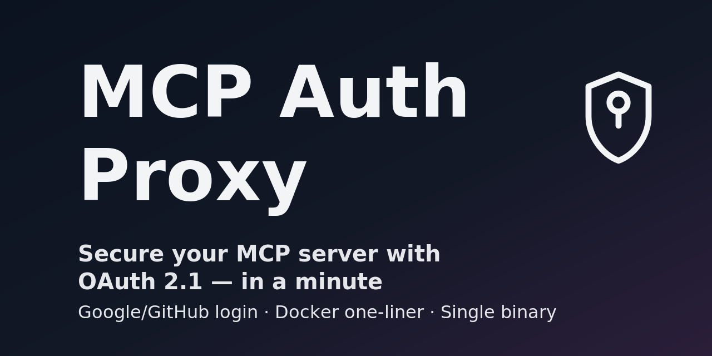

# MCP Auth Proxy



If this project saves you time, please give it a star — it really helps visibility.

## Quickstart

```
docker run --rm -p 8081:8081 --net=host \
  -e EXTERNAL_URL=http://localhost:8081 \
  -e PROXY_URL=http://localhost:8080 \
  -e GLOBAL_SECRET=$(openssl rand -hex 32) \
  -e PASSWORD=changeme \
  -v ./data:/data \
  ghcr.io/sigbit/mcp-auth-proxy:latest
```

.mcp.json
```json
{
  "mcpServers": {
    "mcp": {
      "type": "http",
      "url": "http://localhost:8081/mcp"
    }
  }
}
```


## Overview

MCP Auth Proxy is a secure OAuth 2.1 authentication proxy for Model Context Protocol (MCP) servers. MCP servers are expected to support not only standard OAuth 2.1 flows but also Dynamic Client support (e.g., dynamic client registration) and authentication-related .well-known metadata. On top of that, different MCP clients handle tokens differently, which makes implementation tricky.

MCP Auth Proxy sits in front of your MCP services and enforces sign-in with OAuth providers (such as Google or GitHub) or password before users can access protected MCP resources.

## Note

For a simpler approach to publish local MCP servers over OAuth, consider [MCP Warp](https://github.com/sigbit/mcp-warp), which provides an OAuth Proxy + ngrok-like service. We highly recommend considering this option as well.

## 🔧 Configuration

### Environment Variables

| Variable               | Required | Description                                      | Default                 |
| ---------------------- | -------- | ------------------------------------------------ | ----------------------- |
| `LISTEN`               | No       | Server listen address                            | `:8081`                 |
| `DATA_PATH`            | No       | Data directory path                              | `./data`                |
| `EXTERNAL_URL`         | No       | External URL for OAuth callbacks                 | `http://localhost:8081` |
| `PROXY_URL`            | No       | Target MCP server URL                            | `http://localhost:8080` |
| `GLOBAL_SECRET`        | No       | Global secret for session encryption             | `supersecret`           |
| `GOOGLE_CLIENT_ID`     | No       | Google OAuth client ID                           | -                       |
| `GOOGLE_CLIENT_SECRET` | No       | Google OAuth client secret                       | -                       |
| `GOOGLE_ALLOWED_USERS` | No       | Comma-separated list of allowed Google emails    | -                       |
| `GITHUB_CLIENT_ID`     | No       | GitHub OAuth client ID                           | -                       |
| `GITHUB_CLIENT_SECRET` | No       | GitHub OAuth client secret                       | -                       |
| `GITHUB_ALLOWED_USERS` | No       | Comma-separated list of allowed GitHub usernames | -                       |
| `PASSWORD`             | No       | Password for authentication                      | -                       |
| `PASSWORD_HASH`        | No       | Hash of the password for authentication          | -                       |
| `MODE`                 | No       | Set to `debug` for development mode              | `production`            |

### OAuth Provider Setup

#### Google OAuth Setup
1. Go to the [Google Cloud Console](https://console.cloud.google.com/)
2. Create a new project or select an existing one
3. Enable the Google+ API
4. Create OAuth 2.0 credentials
5. Add authorized redirect URI: `{EXTERNAL_URL}/.auth/google/callback`

#### GitHub OAuth Setup
1. Go to the [Register new GitHub App](https://github.com/settings/apps/new)
2. Set Authorization callback URL: `{EXTERNAL_URL}/.auth/github/callback`

## 🚀 Usage

### Method 1: Download Binary

Download the latest binary from [releases](https://github.com/sigbit/mcp-auth-proxy/releases) and run with command line options:

```bash
./mcp-auth-proxy \
  --external-url "http://localhost:8081" \
  --proxy-url "http://localhost:8080" \
  --global-secret "$(openssl rand -hex 32)" \
  --google-client-id "your-google-client-id" \
  --google-client-secret "your-google-client-secret" \
  --google-allowed-users "user1@example.com,user2@example.com" \
  --github-client-id "your-github-client-id" \
  --github-client-secret "your-github-client-secret" \
  --github-allowed-users "username1,username2" \
  --password "changeme"
```

### Method 2: Docker

```bash
docker run --rm -p 8081:8081 --net=host \
  -e EXTERNAL_URL=http://localhost:8081 \
  -e PROXY_URL=http://localhost:8080 \
  -e GLOBAL_SECRET=$(openssl rand -hex 32) \
  -e GOOGLE_CLIENT_ID="your-google-client-id" \
  -e GOOGLE_CLIENT_SECRET="your-google-client-secret" \
  -e GOOGLE_ALLOWED_USERS="user1@example.com,user2@example.com" \
  -e GITHUB_CLIENT_ID="your-github-client-id" \
  -e GITHUB_CLIENT_SECRET="your-github-client-secret" \
  -e GITHUB_ALLOWED_USERS="username1,username2" \
  -e PASSWORD=changeme \
  -v ./data:/data \
  ghcr.io/sigbit/mcp-auth-proxy:latest
```
